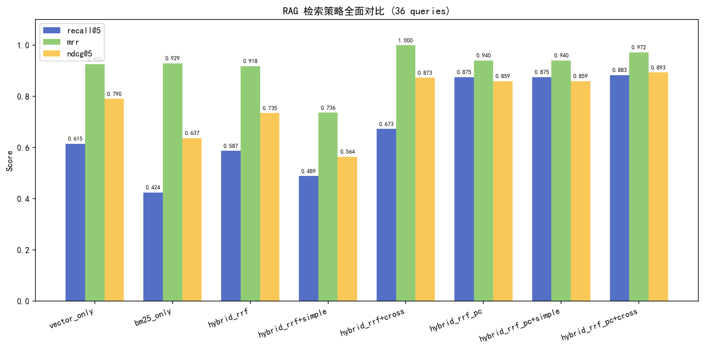
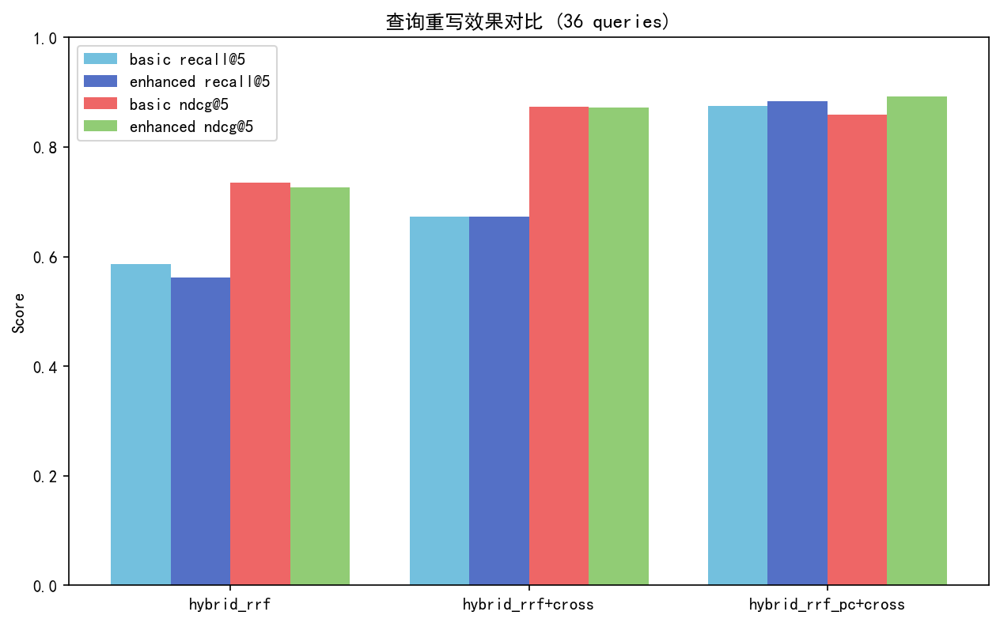
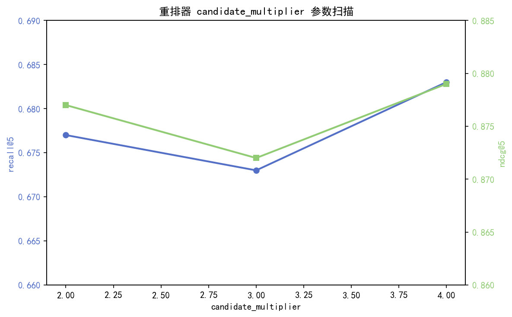
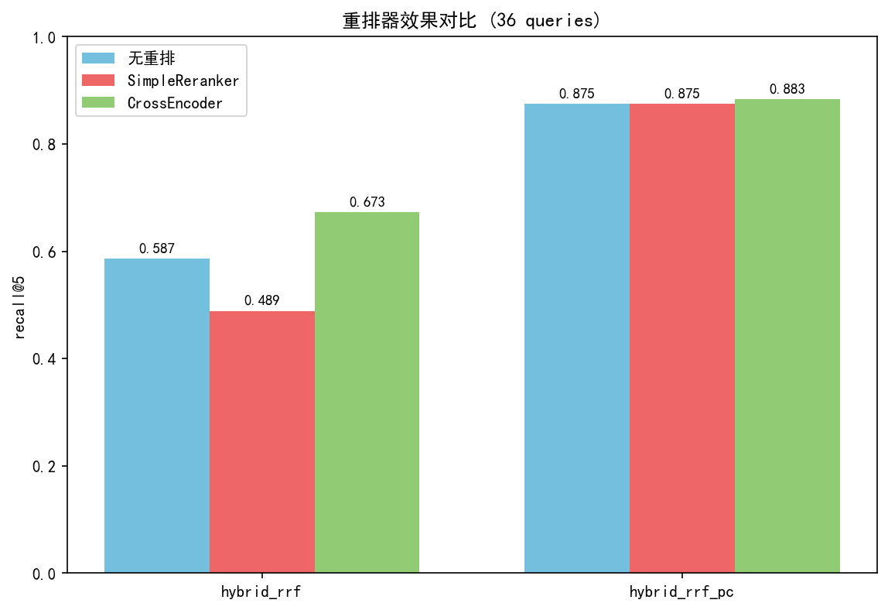
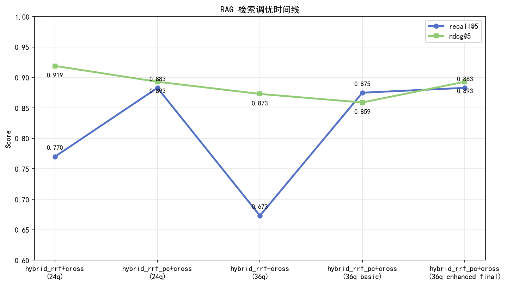
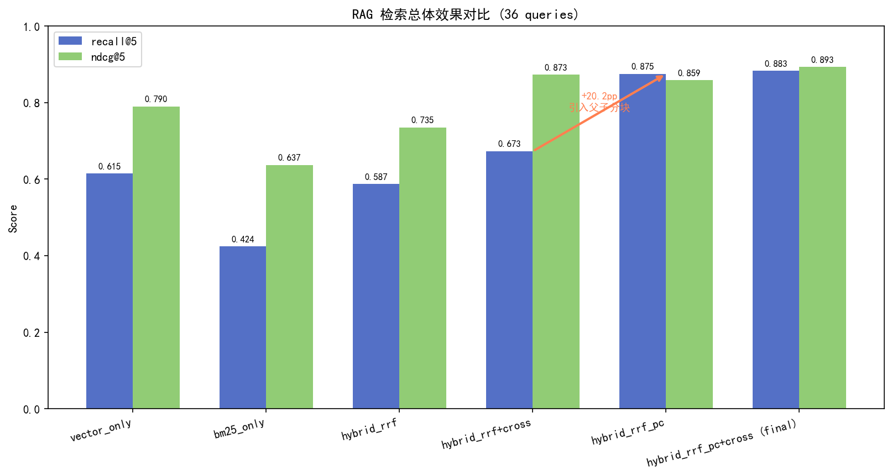

# RAG 检索链路调优完整总结

> 评测时间：2026-07-28  
> 评测集：36 条技术查询（覆盖 Python、FastAPI、SQL、Redis、Celery、async、Docker、Git、REST 等领域）  
> 文档集：12 篇自研 Markdown 技术文档

---

## 1. 实验设置

| 配置项 | 值 |
|---|---|
| Embedding 模型 | `sentence-transformers/paraphrase-multilingual-MiniLM-L12-v2`（384 维） |
| 重排模型 | `BAAI/bge-reranker-base` |
| 向量数据库 | ChromaDB 1.0+，本地持久化 |
| 分块策略 | 默认 `parent_child`，父块 800 字符，子块 160 字符，重叠 30 字符 |
| RRF 参数 | `rrf_k=60` |
| 重排候选池 | `candidate_multiplier=3` |
| 指标 | `recall@5`, `MRR`, `NDCG@5` |

---

## 2. 完整实验数据

### 2.1 基线策略对比（36 查询）

| 策略 | recall@5 | MRR | NDCG@5 | 说明 |
|---|---:|---:|---:|---|
| vector_only | 0.615 | 0.925 | 0.790 | 单路语义检索 |
| bm25_only | 0.424 | 0.929 | 0.637 | 单路关键词检索（已修正 IDF 公式） |
| hybrid_rrf | 0.587 | 0.918 | 0.735 | 向量+BM25 RRF 融合，无重排 |
| hybrid_rrf+simple | 0.489 | 0.736 | 0.564 | RRF+SimpleReranker，反而下降 |
| hybrid_rrf+cross | 0.673 | 1.000 | 0.873 | RRF+CrossEncoder 重排 |
| hybrid_rrf_pc | 0.875 | 0.940 | 0.859 | 父子分块，无重排 |
| hybrid_rrf_pc+simple | 0.875 | 0.940 | 0.859 | 父子分块+SimpleReranker，无增益 |
| hybrid_rrf_pc+cross | **0.883** | **0.972** | **0.893** | 父子分块+CrossEncoder（最终配置） |

### 2.2 查询重写对比（basic vs enhanced）

| 策略 | rewrite_mode | recall@5 | MRR | NDCG@5 | 变化 |
|---|---|---:|---:|---:|---|
| hybrid_rrf | basic | 0.587 | 0.918 | 0.735 | baseline |
| hybrid_rrf | enhanced | 0.562 | 0.958 | 0.726 | recall 略降，MRR 略升 |
| hybrid_rrf+cross | basic | 0.673 | 1.000 | 0.873 | baseline |
| hybrid_rrf+cross | enhanced | 0.673 | 1.000 | 0.872 | **几乎无变化** |
| hybrid_rrf_pc+cross | basic | 0.875 | 0.940 | 0.859 | baseline |
| hybrid_rrf_pc+cross | enhanced | 0.883 | 0.972 | 0.893 | **recall +0.8pp，NDCG +3.4pp** |

> 结论：增强查询重写在标准分块上效果不大，但在父子分块上有稳定增益。

### 2.3 重排器参数扫描（candidate_multiplier）

| multiplier | recall@5 | MRR | NDCG@5 | 说明 |
|---:|---:|---:|---:|---|
| 2 | 0.677 | 1.000 | 0.877 | 候选池 10 |
| 3 | 0.673 | 1.000 | 0.872 | 候选池 15（默认） |
| 4 | 0.683 | 1.000 | 0.879 | 候选池 20，边际增益 |

> 结论：multiplier 在 2~4 之间变化很小，取 3 平衡效率与效果。

### 2.4 数据集扩展影响

| 查询集 | 策略 | recall@5 | MRR | NDCG@5 | 说明 |
|---|---|---:|---:|---:|---|
| 24 queries | hybrid_rrf+cross | 0.770 | 1.000 | 0.919 | 旧数据集较简单 |
| 24 queries | hybrid_rrf_pc+cross | 0.883 | 0.972 | 0.893 | 父子分块已显优势 |
| 36 queries | hybrid_rrf+cross | 0.673 | 1.000 | 0.873 | 扩展后明显下降 |
| 36 queries | hybrid_rrf_pc+cross | 0.883 | 0.972 | 0.893 | 父子分块保持稳定 |

> 结论：数据集扩展后，标准分块策略 recall 从 0.770 掉到 0.673；父子分块策略基本不变，鲁棒性显著更好。

---

## 3. 关键发现

1. **父子分块是最大收益项**  
   从 `hybrid_rrf+cross` 到 `hybrid_rrf_pc+cross`，recall@5 从 **0.673 → 0.883**，提升 **+21.0pp**。

2. **CrossEncoder 重排有效，SimpleReranker 无效**  
   - 标准分块：+SimpleReranker 导致 recall 从 0.587 降到 0.489，NDCG 从 0.735 降到 0.564。  
   - 标准分块：+CrossEncoder 使 recall 提升到 0.673，NDCG 提升到 0.873。  
   - 父子分块：SimpleReranker 完全无增益（与无重排相同）。

3. **增强查询重写效果有限但稳定**  
   仅在父子分块上带来小幅提升（recall +0.8pp，NDCG +3.4pp），在标准分块上几乎无变化。

4. **BM25 单路效果弱于向量检索**  
   `bm25_only` recall@5 仅 0.424，但作为 RRF 融合的一路能提升 recall（对比 `vector_only` 0.615 vs `hybrid_rrf+cross` 0.673）。

5. **重排候选池大小不敏感**  
   candidate_multiplier 从 2 调到 4，recall/NDCG 波动在 ±1pp 以内，选 3 已足够。

---

## 4. 图表

### 4.1 检索策略全面对比

### 4.2 查询重写效果对比

### 4.3 重排器候选池参数扫描

### 4.4 重排器效果对比（含 SimpleReranker）

### 4.5 调优时间线

### 4.6 总体效果对比

---

## 5. 最终落地配置

| 配置项 | 最终值 |
|---|---|
| 默认分块策略 | `parent_child` |
| 默认检索方法 | `hybrid_search_parent_child` |
| 查询重写模式 | `enhanced` |
| rrf_k | 60 |
| candidate_multiplier | 3 |
| 重排模型 | `BAAI/bge-reranker-base` |
| 重排输入最大长度 | 512 |
| 模型加载失败行为 | 降级为无重排 |

---

## 6. 数据文件

- 结构化指标表：[rag_optimization_metrics.csv](../../evaluation/results/rag_optimization_metrics.csv)
- 消融实验原始结果：[ablation_1_3_4.json](../../evaluation/results/ablation_1_3_4.json)
- 图表生成脚本：[generate_optimization_charts.py](../../scripts/generate_optimization_charts.py)
